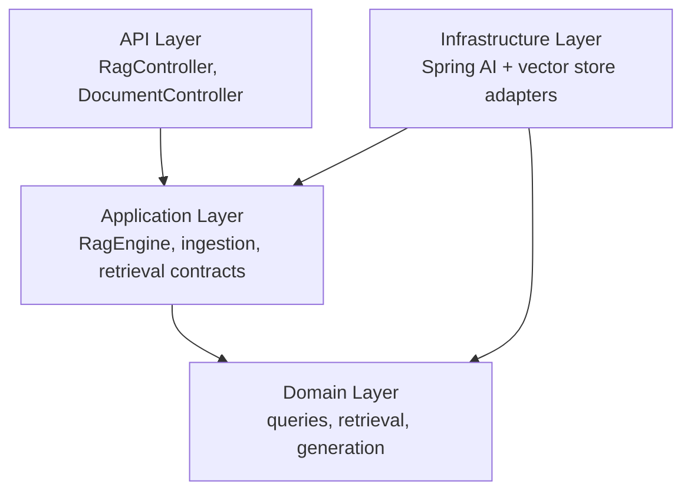
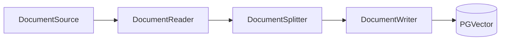
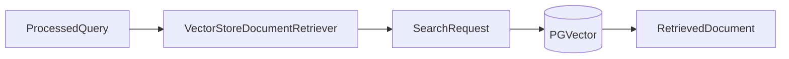
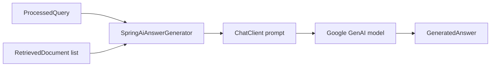
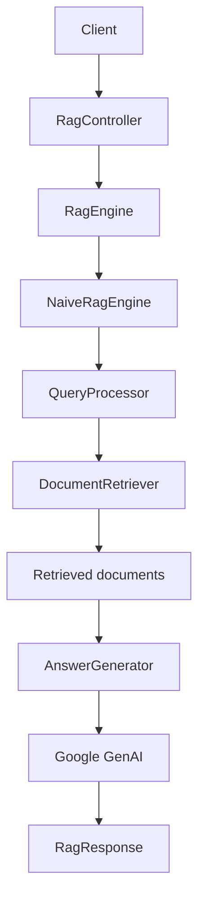
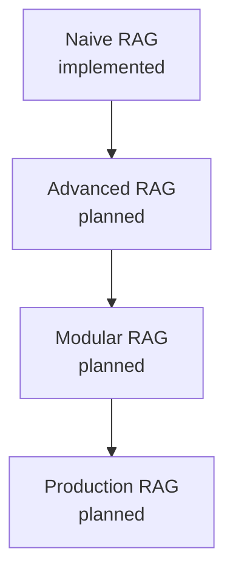

# spring-ai-rag-engine

<p align="center">
  
  
  
  
  
  
</p>

<p align="center">
  <b>A Java 21 / Spring Boot 4.x / Spring AI project that builds a <b>Naive RAG</b> system end-to-end while establishing a layered architecture intended to later host <b>Advanced RAG</b>, <b>Modular RAG</b>, and <b>Production RAG</b> in the same repository.</b>
</p>

## Table of Contents

- [Project Overview](#project-overview)
- [Tech Stack](#tech-stack)
- [Architecture](#architecture)
- [Package Structure](#package-structure)
- [Pipelines](#pipelines)
  - [Ingestion Pipeline](#ingestion-pipeline)
  - [Retrieval Pipeline](#retrieval-pipeline)
  - [Generation Pipeline](#generation-pipeline)
  - [Naive RAG Flow](#naive-rag-flow)
- [Configuration](#configuration)
- [Running the Project](#running-the-project)
- [API Usage](#api-usage)
- [Testing](#testing)
- [Implementation Status](#implementation-status)
- [Future Architecture](#future-architecture)
- [Roadmap](#roadmap)

## Project Overview

This project implements a Retrieval-Augmented Generation (RAG) engine. RAG combines a **retriever** — which fetches relevant documents from a knowledge base using embeddings and vector search — with a **generator** (an LLM) that answers a question using only the retrieved context, grounding the answer in source material instead of relying on the model's parametric memory.

**Naive RAG** is the simplest form of RAG: documents are ingested once (read → split → embedded → stored), and every question triggers the same retrieve-then-generate pipeline with no query rewriting, re-ranking, or feedback loops.

The project is built for two purposes:

1. **To understand RAG fundamentals** — ingestion, retrieval, embeddings, and vector search, and how Spring AI integrates them.
2. **To design an extensible architecture** — the Naive flow is built behind abstractions (interfaces in the `application` and `domain` layers) so that more advanced RAG strategies can be added later **without changing the external API or the application flow**.

> **Scope note:** the **Naive RAG** flow is fully implemented end-to-end, from document upload to a grounded LLM answer with sources. **Advanced RAG** has its orchestration boundary and engine in place (selectable via `rag.strategy: ADVANCED`), but its advanced retrieval techniques are **not implemented yet** — it currently mirrors the naive pipeline. **Modular and Production RAG** remain future targets. The `RagStrategy` enum is the seam for this roadmap.

## Tech Stack

Verified from `pom.xml` and the repository:

| Technology | Version / Artifact | Purpose |
|---|---|---|
| Java | 21 (`java.version`) | Runtime language |
| Spring Boot | 4.1.0 (parent) | Application framework |
| Spring AI | BOM 2.0.0 | AI/embedding/vector-store integration |
| Spring AI Commons | `spring-ai-commons` | Shared Spring AI core |
| Google GenAI chat model | `spring-ai-starter-model-google-genai` | LLM generation |
| Google GenAI embeddings | `spring-ai-starter-model-google-genai-embedding` | Text embeddings |
| PGVector vector store | `spring-ai-starter-vector-store-pgvector` | Vector persistence in PostgreSQL |
| Tika document reader | `spring-ai-tika-document-reader` | Parses uploaded documents (PDF, DOCX, TXT, ...) |
| PostgreSQL JDBC | `postgresql` (runtime) | Database driver |
| Spring Boot Web | `spring-boot-starter-web` | REST API + multipart uploads |
| Bean Validation | `spring-boot-starter-validation` | Request validation |
| Test | `spring-boot-starter-test`, `spring-boot-webmvc-test`, `spring-boot-testcontainers`, `testcontainers-*` | Unit and integration tests |
| Maven | wrapper (`mvnw`) + `pom.xml` | Build tool |
| PostgreSQL / PGVector | `pgvector/pgvector:pg17` via `docker-compose.yml` | Vector store |

## Architecture

The code follows a layered, clean-architecture style with four responsibilities. Dependencies point inward: the API layer depends on the application layer, the application layer depends on the domain layer, and the infrastructure layer implements the abstractions from the application and domain layers.

- **API** — HTTP entry points. `RagController` (question answering) and `DocumentController` (document ingestion) translate HTTP requests into application-level calls and validate input.
- **Application** — orchestration and use-case logic. Defines the engine and pipeline contracts (`RagEngine`, `DocumentIngestionService`, `DocumentReader`, `DocumentSplitter`, `DocumentWriter`, `DocumentRetriever`) and the request/response models. Holds no framework-specific logic.
- **Domain** — pure domain model and core abstractions (`QueryProcessor`, `ProcessedQuery`, `RetrievedDocument`, `AnswerGenerator`, `GeneratedAnswer`, `DocumentReference`). Independent of Spring.
- **Infrastructure** — concrete adapters that implement the application/domain abstractions using Spring AI and the vector store, plus Spring bean configuration.



### Bean wiring

Spring beans are assembled in `dev.brahim.springairagengine.infrastructure.configuration`:

| Configuration class | Beans |
|---|---|
| `ChatClientConfig` | `ChatClient` (built from the auto-configured `ChatClient.Builder`) |
| `IngestionConfiguration` | `DocumentIngestionService` (`DefaultDocumentIngestionService`) |
| `RagConfiguration` | `QueryProcessor` (`DefaultQueryProcessor`), `NaiveRagEngine`, `AdvancedRagEngine`, and the selected `RagEngine` (from `rag.strategy`) |
| `RetrievalConfiguration` | `DocumentRetriever` (`VectorStoreDocumentRetriever`) bound to `RetrievalProperties` |

The adapters themselves (`SpringAiDocumentReader`, `SpringAiDocumentSplitter`, `SpringAiAnswerGenerator`, `VectorStoreDocumentWriter`) are Spring `@Component`s. `VectorStoreDocumentRetriever` is created via `RetrievalConfiguration` so it can be configured from `rag.retrieval.*` properties.

## Package Structure

The package base is `dev.brahim.springairagengine`. Each RAG engine variant lives in its own sub-package under `application.rag`:

```
src/main/java/dev/brahim/springairagengine/

├── api/
│   ├── rag/
│   │   ├── RagController
│   │   └── RagQueryRequest
│   │
│   └── document/
│       └── DocumentController
│
├── application/
│   ├── rag/
│   │   ├── RagEngine          (interface: answer(RagRequest) → RagResponse)
│   │   ├── RagRequest
│   │   ├── RagResponse
│   │   ├── naive/
│   │   │   └── NaiveRagEngine
│   │   └── advanced/
│   │       └── AdvancedRagEngine
│   │
│   ├── ingestion/
│   │   ├── DocumentIngestionService
│   │   ├── DefaultDocumentIngestionService
│   │   ├── DocumentSource
│   │   ├── DocumentReader
│   │   ├── DocumentSplitter
│   │   └── DocumentWriter
│   │
│   └── retrieval/
│       └── DocumentRetriever
│
├── domain/
│   ├── query/
│   │   ├── QueryProcessor
│   │   ├── DefaultQueryProcessor
│   │   └── ProcessedQuery
│   │
│   ├── retrieval/
│   │   └── RetrievedDocument
│   │
│   ├── generation/
│   │   ├── AnswerGenerator
│   │   └── GeneratedAnswer
│   │
│   └── document/
│       └── DocumentReference   (scaffold — not used by the Naive flow)
│
├── infrastructure/
│   ├── springai/
│   │   ├── SpringAiAnswerGenerator
│   │   ├── SpringAiDocumentReader
│   │   └── SpringAiDocumentSplitter
│   │
│   ├── vectorstore/
│   │   ├── VectorStoreDocumentRetriever
│   │   └── VectorStoreDocumentWriter
│   │
│   └── configuration/
│       ├── ChatClientConfig
│       ├── IngestionConfiguration
│       ├── RagConfiguration
│       ├── RetrievalConfiguration
│       ├── RetrievalProperties
│       ├── RagProperties        (bound to rag.strategy)
│       └── RagStrategy           (NAIVE, ADVANCED, MODULAR, PRODUCTION)
│
└── SpringAiRagEngineApplication
```

## Pipelines

### Ingestion Pipeline

Documents are uploaded and processed as **read → split → write**:



1. **`DocumentSource`** — a Spring `Resource` plus filename (created from the uploaded multipart file).
2. **`DocumentReader`** (`SpringAiDocumentReader`) — parses the source with **Tika** (`TikaDocumentReader`) into `Document` objects and adds a `filename` metadata entry.
3. **`DocumentSplitter`** (`SpringAiDocumentSplitter`) — splits documents into smaller chunks with a `TokenTextSplitter` (`chunkSize = 600`, `minChunkSizeChars = 300`, `minChunkLengthToEmbed = 100`, `maxNumChunks = 10_000`, `keepSeparator = true`).
4. **`DocumentWriter`** (`VectorStoreDocumentWriter`) — calls `vectorStore.add(chunks)`. Spring AI's PGVector store embeds each chunk with the configured embedding model and persists the vectors.
5. **`DefaultDocumentIngestionService`** — the orchestrator. If reading produces no documents, or splitting produces no chunks, the pipeline short-circuits and nothing is written.

### Retrieval Pipeline



1. The query is embedded with the same embedding model used at ingestion.
2. `VectorStoreDocumentRetriever` builds a `SearchRequest` with the configured `topK` and `similarityThreshold`, then calls `vectorStore.similaritySearch(...)`.
3. Each match (text, metadata, score) is mapped to a domain `RetrievedDocument`.

Retrieval is configured through the `rag.retrieval.*` properties (see [Configuration](#configuration)).

### Generation Pipeline



1. `SpringAiAnswerGenerator` builds a context string from the retrieved documents (contents joined with `\n\n---\n\n`).
2. It calls `chatClient.prompt()` with a system prompt instructing the model to answer **only** from the provided context and to say so when the context is insufficient, plus the user's query.
3. The Google GenAI chat model (default `gemini-3.1-flash-lite`) produces the answer, wrapped as a `GeneratedAnswer`.

### Naive RAG Flow

The complete question-answering flow orchestrated by `NaiveRagEngine`:



1. **Client → RagController** — `POST /api/v1/rag/query` with a JSON `{ "query": "..." }` body.
2. **RagController → RagEngine** — the validated query is wrapped in a `RagRequest` and delegated to the engine contract.
3. **NaiveRagEngine** orchestrates the pipeline:
   - **QueryProcessor** (`DefaultQueryProcessor`) trims and validates the raw query into a `ProcessedQuery`.
   - **DocumentRetriever** embeds the query, runs vector search, and returns the most relevant `RetrievedDocument`s (content, metadata, score).
   - **AnswerGenerator** builds the LLM prompt from the retrieved context and the query.
4. **RagResponse** returns the generated answer together with the retrieved sources.

The engine, retriever, and generator are tested in isolation; `NaiveRagEngine` is verified to call them in the correct order.

## Configuration

### Environment variables

Copy `.env.example` to `.env` (it is git-ignored) and fill in your values. Spring Boot 4 loads `.env` from the working directory via `spring.config.import: "optional:file:.env[.properties]"`.

| Variable | Required | Default | Purpose |
|---|---|---|---|
| `GEMINI_API_KEY` | ✅ | — | Google GenAI API key (used for both chat and embeddings) |
| `PROJECT_ID` | ✅ | — | Google Cloud project ID |
| `POSTGRES_URL` | — | `jdbc:postgresql://localhost:5432/rag` | PostgreSQL JDBC URL |
| `POSTGRES_USER` | — | `postgres` | Database user |
| `POSTGRES_PASSWORD` | — | `postgres` | Database password |
| `GEMINI_CHAT_MODEL` | — | `gemini-3.1-flash-lite` | Chat model override |
| `GEMINI_EMBEDDING_MODEL` | — | `gemini-embedding-001` | Embedding model override |

### Application settings (`src/main/resources/application.yaml`)

| Setting | Default | Meaning |
|---|---|---|
| `spring.servlet.multipart.max-file-size` / `max-request-size` | `50MB` | Upload limits |
| `spring.ai.google.genai.*` | — | API key, project ID, chat/embedding models |
| `spring.ai.vectorstore.pgvector.initialize-schema` | `true` | Create the vector table at startup |
| `spring.ai.vectorstore.pgvector.dimensions` | `768` | Embedding dimensions |
| `spring.ai.vectorstore.pgvector.index-type` | `HNSW` | Vector index type |
| `spring.ai.vectorstore.pgvector.distance-type` | `COSINE_DISTANCE` | Similarity metric |
| `rag.retrieval.top-k` | `5` | Number of documents retrieved |
| `rag.retrieval.similarity-threshold` | `0.0` | Minimum similarity score |
| `rag.strategy` | `NAIVE` | RAG engine in use: `NAIVE` or `ADVANCED` |

## Running the Project

### Prerequisites

- Java 21
- Docker (for PostgreSQL/PGVector via `docker-compose.yml`)
- A Google Cloud project with the **Generative Language API** enabled and a valid API key

### 1. Start PostgreSQL / PGVector

```sh
docker compose up -d
```

This starts `pgvector/pgvector:pg17` on port `5432` with database `rag`. It reads `POSTGRES_USER` / `POSTGRES_PASSWORD` from your `.env` file.

### 2. Configure environment

```sh
cp .env.example .env
```

Then edit `.env` and set `GEMINI_API_KEY` and `PROJECT_ID` (and `POSTGRES_*` if you changed the compose defaults).

### 3. Build and run

```sh
./mvnw spring-boot:run
```

(Windows: `mvnw.cmd spring-boot:run`)

The application starts on `http://localhost:8080`.

### 4. Ingest a document and ask a question

See [API Usage](#api-usage) below. A sample document is available at `src/main/resources/documents/resume.pdf`.

## API Usage

### Ask a question

`POST /api/v1/rag/query`

```sh
curl -X POST http://localhost:8080/api/v1/rag/query \
  -H "Content-Type: application/json" \
  -d '{"query": "What does the candidate list as their skills?"}'
```

Response `200 OK`:

```json
{
  "answer": "The candidate lists ...",
  "sources": [
    {
      "content": "...",
      "metadata": { "filename": "resume.pdf" },
      "score": 0.87
    }
  ]
}
```

Validation:

- Blank or missing `query` → `400 Bad Request` (via `@NotBlank` on `RagQueryRequest`).

### Upload a document

`POST /api/v1/documents` (multipart/form-data)

```sh
curl -X POST http://localhost:8080/api/v1/documents \
  -F "file=@src/main/resources/documents/resume.pdf"
```

- Success → `201 Created`.
- Empty file → `400 Bad Request`.
- Files up to `50MB` (configurable in `application.yaml`).

## Testing

Run the full suite:

```sh
./mvnw test
```

(Windows: `mvnw.cmd test`)

> The `SpringAiRagEngineApplicationTests` context test boots the full Spring context, which requires the PostgreSQL/PGVector container to be running (`docker compose up -d`).

Test coverage (19 tests):

| Test class | What it covers |
|---|---|
| `RagControllerTest` | REST contract for `/api/v1/rag/query` (answer + sources JSON, blank/missing query → 400) |
| `NaiveRagEngineTest` | Orchestration order and source propagation |
| `AdvancedRagEngineTest` | `RagEngine` contract, orchestration order, null-request rejection |
| `DefaultDocumentIngestionServiceTest` | read → split → write, short-circuiting on empty read/split |
| `DefaultQueryProcessorTest` | Normalization, trimming, null/blank rejection |
| `VectorStoreDocumentRetrieverTest` | Mapping to `RetrievedDocument`, configured search parameters |
| `SpringAiAnswerGeneratorTest` | Prompt/chat-client interaction, empty-context answer |
| `SpringAiRagEngineApplicationTests` | Spring context loads |

## Implementation Status

### Implemented

- Layered packages (api / application / domain / infrastructure) with clear responsibilities.
- Full **document ingestion** pipeline: Tika reader → token splitter → PGVector writer.
- Full **Naive RAG** flow: query processing → vector retrieval → grounded generation.
- REST API: `POST /api/v1/rag/query` and `POST /api/v1/documents` (multipart, 50MB limit).
- Bean wiring via `ChatClientConfig`, `IngestionConfiguration`, `RagConfiguration`, `RetrievalConfiguration`.
- Configurable retrieval via `rag.retrieval.*` properties (`RetrievalProperties`).
- Configurable RAG engine selection via `rag.strategy` (`RagProperties`), with `NaiveRagEngine` and `AdvancedRagEngine` as swappable implementations of the stable `RagEngine` contract.
- Environment-based configuration (`.env` + `application.yaml`).
- PostgreSQL/PGVector via `docker-compose.yml`.
- 22 unit and integration tests.

### Scaffold only (not wired / not implemented)

- Advanced RAG retrieval techniques (query rewriting/expansion, re-ranking, hybrid search) — `AdvancedRagEngine` currently mirrors the naive pipeline.
- `RagStrategy` values `MODULAR` and `PRODUCTION` — defined but not functional.
- `DocumentReference` — domain record not referenced by the Naive flow.

## Future Architecture

The repository is designed to evolve through increasingly sophisticated RAG architectures:



| Stage | Status | Planned capabilities |
|---|---|---|
| **Naive RAG** | ✅ Implemented | Single-shot retrieval + generation as described above |
| **Advanced RAG** | 🚧 Planned | Query rewriting/expansion, re-ranking, hybrid search (dense + keyword) |
| **Modular RAG** | 🚧 Planned | Composable modules for retrieval, memory, routing, post-processing |
| **Production RAG** | 🚧 Planned | Observability, evaluation, caching, guardrails, multi-tenant deployment |

The `RagEngine` contract, the `RagStrategy` enum, and the layered abstractions are the seam through which these variants can be added without breaking the public API.

## Roadmap

- [x] Establish layered architecture and core contracts
- [x] Add Spring AI, Google GenAI, embedding, and PGVector dependencies
- [x] Implement document ingestion (read → split → write)
- [x] Implement the Naive RAG question-answering flow
- [x] Expose the flow through REST APIs (query + upload)
- [x] Configure PostgreSQL/PGVector via Docker Compose
- [x] Add unit/integration test coverage
- [ ] **Future** — Advanced RAG techniques (query rewriting, re-ranking, hybrid search) on top of `AdvancedRagEngine`
- [ ] **Future** — Modular RAG (`RagStrategy.MODULAR`)
- [ ] **Future** — Production RAG (`RagStrategy.PRODUCTION`)

Architecture diagrams (StarUML `.asta` sources and rendered `.png` files) live under `docs/architecture/`.
