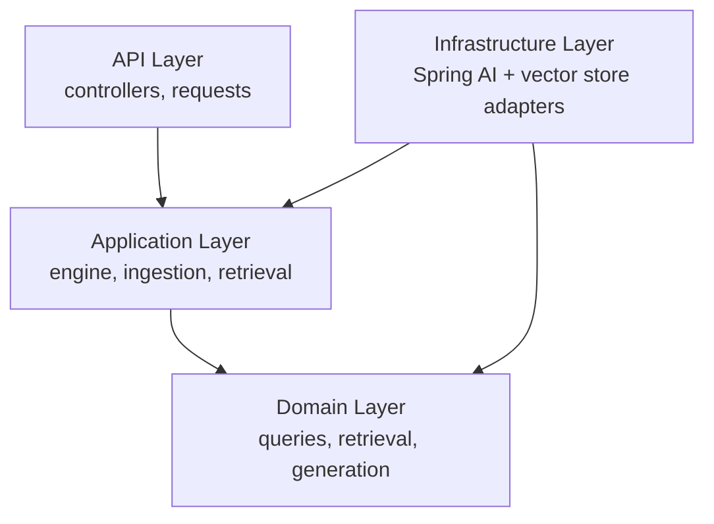
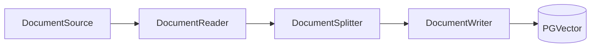
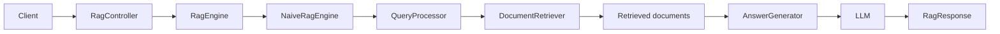

# spring-ai-rag-engine

<p align="center">
  
  
  
  
  
  
</p>

<p align="center">
  <b>A Java 21 / Spring Boot 4.x / Spring AI project that builds a <b>Naive RAG</b> system while establishing a layered architecture intended to later host <b>Advanced RAG</b>, <b>Modular RAG</b>, and <b>Production RAG</b> in the same repository.</b>
</p>

## Table of Contents

- [Overview](#overview)
- [Goals](#goals)
- [Tech Stack](#tech-stack)
- [Architecture](#architecture)
- [Current Naive RAG Flow](#current-naive-rag-flow)
- [Implementation Status](#implementation-status)
- [Building](#building)
- [Roadmap](#roadmap)

## Overview

This project implements a Retrieval-Augmented Generation (RAG) engine. RAG combines a **retriever** — which fetches relevant documents from a knowledge base using embeddings and vector search — with a **generator** (an LLM) that answers a question using only the retrieved context, grounding the answer in source material instead of relying on the model's parametric memory.

**Naive RAG** is the simplest form of RAG: documents are ingested once (read → split → embedded → stored), and every question triggers the same retrieve-then-generate pipeline with no query rewriting, re-ranking, or feedback loops.

The project is built for two purposes:

1. **To understand RAG fundamentals** — ingestion, retrieval, embeddings, and vector search, and how Spring AI integrates them.
2. **To design an extensible architecture** — the current Naive flow is deliberately built behind abstractions so that more advanced RAG strategies can be added later **without changing the external API or the application flow**. The strategy selector (`RagStrategy`) and engine contract already anticipate Naive, Advanced, Modular, and Production variants.

> **Scope note:** the codebase currently contains the architectural scaffold and contracts for the Naive RAG flow. Advanced, Modular, and Production RAG are **future** targets and are not implemented.

## Goals

- Understand RAG fundamentals: ingestion, retrieval, augmentation, and generation.
- Understand the document ingestion pipeline (read → split → write to a vector store).
- Understand retrieval: embeddings, vector search, and similarity scoring.
- Understand how Spring AI provides chat models, embeddings, document transformations, and vector-store integration.
- Establish clean architectural abstractions (api / application / domain / infrastructure) that can evolve toward more advanced RAG systems without breaking the external contract.

## Tech Stack

Verified from `pom.xml` and the repository:

| Technology | Version / Artifact | Purpose |
|---|---|---|
| Java | 21 (`java.version`) | Runtime language |
| Spring Boot | 4.1.0 (parent) | Application framework |
| Spring AI | BOM 2.0.0 | AI/embedding/vector-store integration |
| Spring AI Commons | `spring-ai-commons` | Shared Spring AI core |
| Google GenAI chat model | `spring-ai-starter-model-google-genai` | LLM generation |
| Google GenAI embeddings | `spring-ai-starter-model-google-genai-embedding` | Text embeddings |
| PGVector vector store | `spring-ai-starter-vector-store-pgvector` | Vector persistence in PostgreSQL |
| Maven | wrapper (`mvnw`) + `pom.xml` | Build tool |
| PostgreSQL / PGVector | declared via starter dependency | Vector store (infrastructure not yet configured) |
| Docker | — | Planned; no Dockerfile or `docker-compose` files are present yet |

> **Current state:** the dependencies above are declared, but runtime configuration is minimal — `src/main/resources/application.yaml` only sets the application name. There is no PostgreSQL/PGVector connection configuration and no Docker setup in the repository yet.

## Architecture

The code follows a layered, clean-architecture style with four responsibilities:

- **API** — HTTP-facing entry points (controllers and request records). Translates client requests into application-level calls. *Currently the controllers are plain classes wired to the services; REST annotations and endpoints are not yet defined.*
- **Application** — orchestration and use-case logic. Defines the engine and pipeline contracts (`RagEngine`, `DocumentIngestionService`, `DocumentRetriever`) and the request/response models. Holds no framework-specific logic.
- **Domain** — pure domain model and the core abstractions (`QueryProcessor`, `ProcessedQuery`, `RetrievedDocument`, `AnswerGenerator`, `GeneratedAnswer`, `DocumentReference`). Independent of Spring.
- **Infrastructure** — concrete adapters that implement the application/domain abstractions using Spring AI and the vector store (`SpringAiAnswerGenerator`, `SpringAiDocumentReader`, `SpringAiDocumentSplitter`, `VectorStoreDocumentRetriever`, `VectorStoreDocumentWriter`), plus configuration (`RagProperties`, `RagStrategy`).

Dependencies point inward: the API layer depends on the application layer, the application layer depends on the domain layer, and the infrastructure layer implements the abstractions from the application and domain layers.



### Repository structure

The actual package base is `dev.brahim.springairagengine`. Note that the infrastructure package is spelled `infrastracture` in the source tree, and the naive engine currently lives in a top-level `rag` package:

```
src/main/java/dev/brahim/springairagengine/

├── api/
│   ├── rag/
│   │   ├── RagController
│   │   └── RagQueryRequest
│   │
│   └── document/
│       └── DocumentController
│
├── application/
│   ├── rag/
│   │   ├── RagEngine          (interface: answer(RagRequest) → RagResponse)
│   │   ├── RagRequest
│   │   └── RagResponse
│   │
│   ├── ingestion/
│   │   ├── DocumentIngestionService
│   │   ├── DefaultDocumentIngestionService
│   │   ├── DocumentSource
│   │   ├── DocumentReader
│   │   ├── DocumentSplitter
│   │   └── DocumentWriter
│   │
│   └── retrieval/
│       └── DocumentRetriever
│
├── domain/
│   ├── query/
│   │   ├── QueryProcessor
│   │   ├── DefaultQueryProcessor
│   │   └── ProcessedQuery
│   │
│   ├── retrieval/
│   │   └── RetrievedDocument
│   │
│   ├── generation/
│   │   ├── AnswerGenerator
│   │   └── GeneratedAnswer
│   │
│   └── document/
│       └── DocumentReference
│
├── infrastracture/            (sic — spelling in source tree)
│   ├── springai/
│   │   ├── SpringAiAnswerGenerator
│   │   ├── SpringAiDocumentReader
│   │   └── SpringAiDocumentSplitter
│   │
│   ├── vectorstore/
│   │   ├── VectorStoreDocumentRetriever
│   │   └── VectorStoreDocumentWriter
│   │
│   └── configuration/
│       ├── RagProperties
│       └── RagStrategy        (NAIVE, ADVANCED, MODULAR, PRODUCTION)
│
├── rag/
│   ├── NaiveRagEngine         (current engine: query → retrieval → generation)
│   └── AdvancedRagEngine      (placeholder, not implemented)
│
└── SpringAiRagEngineApplication
```

### RAG strategies

`RagStrategy` defines the roadmap of engine variants. Only `NAIVE` is being built now; the rest are placeholders for the future:

| Strategy | Status |
|---|---|
| `NAIVE` | Current target — architectural scaffold in place |
| `ADVANCED` | Future (e.g. query rewriting, re-ranking, hybrid search) |
| `MODULAR` | Future |
| `PRODUCTION` | Future |

## Current Naive RAG Flow

The intended flow below is what the architecture is built to support. At present the contracts and adapters exist, but the pipeline is not fully wired: several adapter methods are stubs, and no REST endpoints are exposed yet (see [Implementation status](#implementation-status)).

### Document ingestion

A document is read, split into chunks, and written to the vector store:



1. **DocumentSource** — identifies an input (a Spring `Resource` plus filename).
2. **DocumentReader** — reads the source into `org.springframework.ai.document.Document` objects.
3. **DocumentSplitter** — splits documents into smaller chunks for precise retrieval.
4. **DocumentWriter** — writes the chunks into the vector store, where they are embedded and stored.
5. **PGVector** — a PostgreSQL extension used as the vector store; Spring AI's PGVector starter handles the embedding persistence and similarity search.

### Question answering

A question goes through retrieval and generation to produce an answer with sources:



1. **Client** → **RagController** — the HTTP entry point accepts the user's question.
2. **RagController** → **RagEngine** — delegates to the engine contract (`answer(RagRequest) → RagResponse`).
3. **RagEngine** → **NaiveRagEngine** — the current naive implementation orchestrates the pipeline.
4. **QueryProcessor** — normalizes the raw question into a `ProcessedQuery`.
5. **DocumentRetriever** — embeds the query, performs a vector search in PGVector, and returns the most relevant `RetrievedDocument`s (content, metadata, score).
6. **AnswerGenerator** — builds an LLM prompt from the retrieved context and the question.
7. **LLM** — the Google GenAI model generates a grounded answer.
8. **RagResponse** — returns the answer together with the source references.

**PGVector** is the vector store: retrieved documents and query embeddings live in the same PostgreSQL database and are compared by vector similarity. **Spring AI** provides the integration layer — chat models, embedding models, document transformers, and the PGVector vector store.

## Implementation Status

The repository is at the **architectural scaffold** stage. What exists:

- Layered packages (api / application / domain / infrastracture) with clear responsibilities.
- Core contracts: `RagEngine`, `DocumentIngestionService`, `DocumentReader`, `DocumentSplitter`, `DocumentWriter`, `DocumentRetriever`, `QueryProcessor`, `AnswerGenerator`.
- Spring AI and vector-store adapters that implement those contracts (`SpringAiAnswerGenerator`, `SpringAiDocumentReader`, `SpringAiDocumentSplitter`, `VectorStoreDocumentRetriever`, `VectorStoreDocumentWriter`).
- Strategy configuration (`RagProperties`, `RagStrategy`).
- Architecture diagrams under `docs/architecture/` (StarUML `.asta` sources and rendered `.png` files).

What is **not** implemented yet:

- No REST mappings on `RagController` / `DocumentController` (no endpoints exposed).
- Adapter methods are stubs (return `null` / `List.of()`); the pipeline is not yet wired end-to-end.
- No PostgreSQL/PGVector connection configuration (`application.yaml` only sets the app name).
- No Docker files (`Dockerfile`, `docker-compose`).
- No Spring bean configuration tying the abstractions to the infrastructure adapters.

## Building

The project uses the Maven wrapper:

```sh
./mvnw clean verify
```

(Windows: `mvnw.cmd clean verify`)

## Roadmap

- [x] Establish layered architecture and core contracts
- [x] Add Spring AI, Google GenAI, embedding, and PGVector dependencies
- [x] Scaffold the Naive RAG engine and infrastructure adapters
- [ ] Wire the document ingestion pipeline (read → split → write)
- [ ] Wire the Naive RAG question-answering flow
- [ ] Configure PostgreSQL / PGVector and run via Docker
- [ ] **Future** — Advanced RAG (`RagStrategy.ADVANCED`)
- [ ] **Future** — Modular RAG (`RagStrategy.MODULAR`)
- [ ] **Future** — Production RAG (`RagStrategy.PRODUCTION`)
